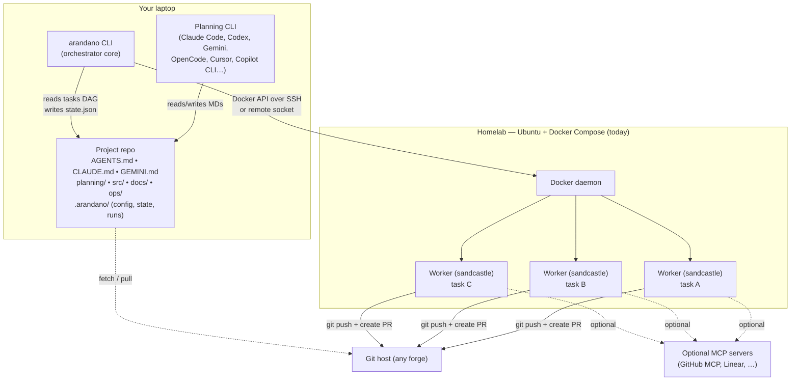
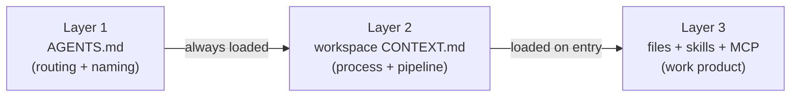
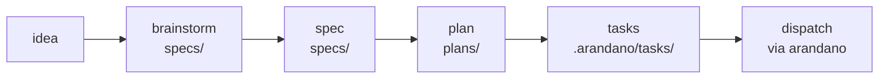
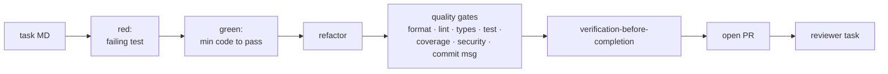
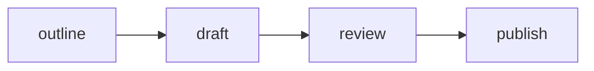
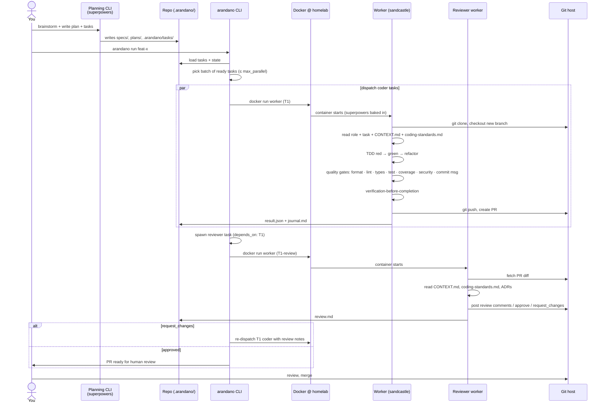
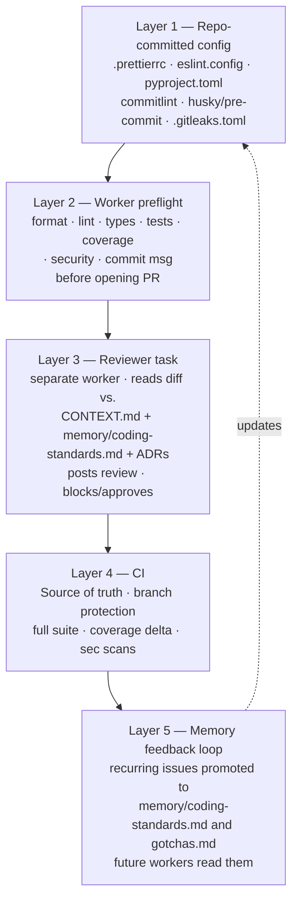
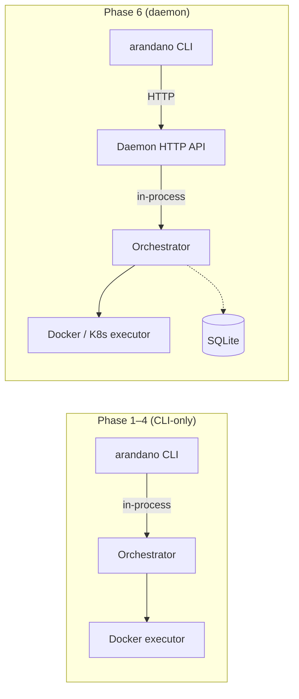
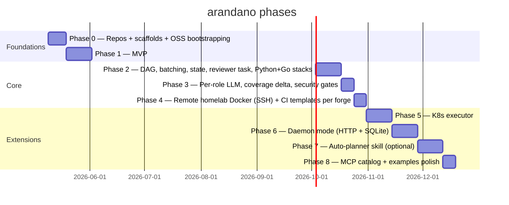

# arandano — Agentic Software Development System

A reusable, **MIT-licensed open-source** system for developing software with coding agents. It combines:

- **[superpowers](https://github.com/obra/superpowers)** — planning, specs, task definition, TDD, debugging, code review, and dev workflow skills
- **[sandcastle](https://github.com/mattpocock/sandcastle)** — Claude Code (and other CLI agents: OpenCode, Gemini CLI, Codex…) running in isolated Docker containers, with multi-provider support
- **Three-layer Markdown architecture** ([Skool / Jake Van Clief, _Stop Building AI Agents. Use This Folder System Instead._](https://www.youtube.com/watch?v=MkN-ss2Nl10)) — Layer 1 routing (`AGENTS.md`/`CLAUDE.md`), Layer 2 workspace context (`CONTEXT.md`), Layer 3 files + skills + MCP servers
- **Per-role LLM/CLI flexibility** — configurable per role, overridable per task
- **Markdown-as-database** — no SQL, no vector DB, no external issue tracker. Files + naming conventions + Git history are the substrate.
- **Five-layer code-quality enforcement** — repo config, worker preflight, reviewer task, CI, and a memory feedback loop

The system ships as an npm package with a CLI (`arandano`) that scaffolds project structure, dispatches batches of tasks to sandcastle workers on a homelab, and tracks state until each task lands as a PR.

---

## 1. Goals

1. **Reusable across software projects.** One install (`npm i -g arandano`), works on any repo.
2. **Tool-agnostic planning.** Specs, plans, tasks, memory, and issues are Markdown — readable by any agent CLI (Claude Code, Codex, Gemini, OpenCode, Cursor, Copilot CLI…).
3. **Hybrid batched execution.** Independent tasks run in parallel containers; declared dependencies enforce order.
4. **Per-role LLM choice.** Configure which CLI/model handles each role (planner, coder, reviewer, tester); override per task.
5. **TDD by default.** The `coder` role writes a failing test first, then minimum code to pass, then refactor. Acceptance gating enforces this.
6. **Quality gates by default.** Format, lint, types, tests, coverage, security, and commit messages all enforced — inside the worker, in CI, and reviewed by an agent reviewer.
7. **PR-based integration.** Each task produces a feature branch and a pull request for human review.
8. **Homelab-first.** Targets the existing Ubuntu/Docker-Compose box. Kubernetes when ready.
9. **CLI now, daemon later.** Local CLI orchestrator with a clean interface that lifts into a homelab daemon without a rewrite.
10. **Open source, MIT.** Friendly to forks, contributions, and reuse. Reproducible builds, clear `CONTRIBUTING.md`, semantic-release.

## 2. Non-goals (v1)

- Auto-planning (LLM-driven decomposition of `plan.md` into `tasks/`). Optional Phase 7.
- Per-task token/cost budget enforcement.
- Web UI. CLI + state file is enough.
- Multi-tenant / cloud-hosted SaaS. Single-user, single homelab.
- **External databases or vector stores.** Memory, issues, decisions all live as MD in the repo. Naming conventions replace queries.
- **External issue tracker dependency.** GitHub Issues / Forgejo Issues / Jira are usable but not required. Canonical issue store is `planning/issues/*.md`.

## 3. Constraints & key decisions

| #       | Decision                                                                                                                                                                                                                                          | Rationale                                                                                                                  |
| ------- | ------------------------------------------------------------------------------------------------------------------------------------------------------------------------------------------------------------------------------------------------- | -------------------------------------------------------------------------------------------------------------------------- |
| D1      | npm package; CLI installable globally (`npm i -g arandano`)                                                                                                                                                                                       | Matches the user's tooling and superpowers' own model                                                                      |
| D2      | No fork of superpowers; install it as a Claude Code plugin alongside                                                                                                                                                                              | Upstream updates flow naturally; we only add what's missing                                                                |
| D3      | Markdown files are canonical state for specs/plans/tasks/memory/issues; orchestrator state is separate (`.arandano/state.json`, gitignored)                                                                                                       | MD is tool-agnostic; orchestrator state is implementation detail                                                           |
| D4      | Three-layer architecture (Layer 1 routing, Layer 2 workspace context, Layer 3 files+skills+MCP) for project scaffolds                                                                                                                             | Selected by user; matches the video's pedagogy and is tool-portable                                                        |
| D5      | Branch + PR per task                                                                                                                                                                                                                              | Standard Git flow, integrates with existing CI/review                                                                      |
| D6      | Hybrid batched workflow with explicit `depends_on`                                                                                                                                                                                                | Selected by user                                                                                                           |
| D7      | Local CLI orchestrator first; daemon mode later                                                                                                                                                                                                   | Selected by user; reduces homelab footprint at start                                                                       |
| D8      | Docker executor first, K8s later, behind an `Executor` interface                                                                                                                                                                                  | Matches homelab today and future direction                                                                                 |
| D9      | Per-role LLM/CLI config in `.arandano/config.yaml`; per-task override in task frontmatter                                                                                                                                                         | Flexibility without explosion                                                                                              |
| D10     | Sandcastle handles provider switching at execution time (Claude Code, OpenCode, Gemini, Codex…)                                                                                                                                                   | Sandcastle already supports this; we don't reinvent                                                                        |
| D11     | `AGENTS.md` is canonical; `CLAUDE.md` and `GEMINI.md` are mirrors                                                                                                                                                                                 | One source of truth, every CLI finds the file it expects                                                                   |
| D12     | TDD is the default for the `coder` role. Red → green → refactor enforced via task acceptance + worker preflight checks. Per-task `tdd: relaxed` allowed for documented exceptions                                                                 | superpowers leans heavily on TDD; quality follows from making it the default, not the option                               |
| D13     | Worker container lives in a separate repo (`arandano-worker`). Image versioned independently; CLI pins a known-good tag                                                                                                                           | Different build tooling (Docker), different release cadence, reusable standalone                                           |
| D14     | CLI + core + executors + templates + skills live in one monorepo (`arandano`) as an npm workspace                                                                                                                                                 | Lock-step internal versioning; cross-package refactors stay atomic                                                         |
| D15     | MIT license, OSS posture from day 1. `LICENSE`, `CONTRIBUTING.md`, `CODE_OF_CONDUCT.md`, semantic-release, `CHANGELOG.md`, examples repo                                                                                                          | Friendly to forks and contributions                                                                                        |
| D16     | Markdown + naming conventions + Git history are the entire data substrate. No SQL, no vector DB, no external issue tracker                                                                                                                        | Matches the "folder is the app" pattern from the reference video; portable, auditable, AI-readable                         |
| **D17** | **Five-layer quality enforcement**: repo-committed config, worker preflight, reviewer task, CI, and a memory feedback loop. No layer is optional in v1 except the reviewer task per project policy                                                | Defense in depth; fast feedback (worker) + source-of-truth (CI) + agent judgment (reviewer) + continuous learning (memory) |
| **D18** | **Opinionated per-stack defaults.** `arandano init --stack=<node-ts\|python\|go\|polyglot>` scaffolds a complete quality toolchain (formatter, linter, type-checker, test runner, coverage, security, commit lint). Users can override any config | Removes setup friction; agents know the exact commands to run                                                              |
| **D19** | **Reviewer task on by default.** Coder tasks auto-spawn a downstream reviewer task with `depends_on: [<coder>]`. Configurable per project (`reviewer_required: false` to disable)                                                                 | Pattern-level checks the linter can't make; provides a second pair of (synthetic) eyes before human review                 |

---

## 4. System architecture



---

## 5. Component breakdown

| Component              | Repo                | Package / artifact                | Responsibility                                                                                                                                                                                                                                                   |
| ---------------------- | ------------------- | --------------------------------- | ---------------------------------------------------------------------------------------------------------------------------------------------------------------------------------------------------------------------------------------------------------------- |
| CLI                    | `arandano`          | `@arandano/cli`                   | Subcommands: `init`, `plan`, `tasks`, `run`, `status`, `retry`, `cleanup`, `doctor`, `memory`, `issue`                                                                                                                                                           |
| Core / orchestrator    | `arandano`          | `@arandano/core`                  | DAG parsing, batch selection, state machine, dispatch, retries                                                                                                                                                                                                   |
| Docker executor        | `arandano`          | `@arandano/executors-docker`      | Implements the `Executor` interface against a local or remote Docker daemon                                                                                                                                                                                      |
| K8s executor (Phase 5) | `arandano`          | `@arandano/executors-k8s`         | K8s Jobs implementation of `Executor`                                                                                                                                                                                                                            |
| Local executor         | `arandano`          | `@arandano/executors-local`       | Runs a worker as a child process (debug only — no isolation)                                                                                                                                                                                                     |
| Templates              | `arandano`          | `@arandano/templates`             | Project scaffold (Skool 3-layer), default role MDs, `AGENTS.md`, `.arandano/` skeleton, **per-stack quality configs** (Prettier/ESLint/tsc/Vitest, ruff/mypy/pytest, gofmt/golangci-lint/go test, commitlint, gitleaks, husky/pre-commit, CI workflow templates) |
| Skills                 | `arandano`          | `@arandano/skills`                | New superpowers-style skills: `dispatching-to-sandcastle`, `picking-up-task-result`, `writing-task-md`, `memory-write`, `running-quality-gates`, `decomposing-plan-into-tasks` (Phase 7)                                                                         |
| Worker container       | `arandano-worker`   | OCI image `arandano/worker:<ver>` | Sandcastle + bundled superpowers + entrypoint + Node helper. Reads task MD, invokes the configured CLI/model, **runs the full quality gate sequence**, opens a PR, writes `result.json` + `journal.md`                                                           |
| Examples (Phase 1+)    | `arandano-examples` | sample scaffolded projects        | Demonstrates the system on 2–3 stack flavors (Node-TS service, Python CLI, static site)                                                                                                                                                                          |

Distribution: users install **only** `arandano` (the CLI). The CLI pulls the worker image from a registry as configured.

---

## 6. Project scaffold (created by `arandano init --stack=node-ts`)

```
my-app/
├── AGENTS.md                      # Layer 1 — canonical: identity + routing
├── CLAUDE.md                      # symlink/mirror → AGENTS.md
├── GEMINI.md                      # symlink/mirror → AGENTS.md
├── LICENSE                        # MIT (you can replace)
├── README.md
├── .editorconfig
├── .gitleaks.toml
├── .commitlintrc.cjs
├── .husky/                        # commit + push hooks
├── .prettierrc.json               # stack-specific (node-ts here)
├── eslint.config.js               # stack-specific
├── tsconfig.json                  # stack-specific
├── vitest.config.ts               # stack-specific
├── .github/workflows/ci.yml       # CI quality gates
├── .arandano/
│   ├── config.yaml                # roles, executor, MCP, quality_defaults
│   ├── state.json                 # task DAG + run state (gitignored)
│   ├── roles/
│   │   ├── planner.md
│   │   ├── coder.md               # explicitly TDD red→green→refactor
│   │   ├── reviewer.md            # checklist-driven reviewer protocol
│   │   └── tester.md
│   ├── tasks/
│   │   └── 2026-05-08-feat-x/
│   │       ├── T1-foo.md
│   │       ├── T2-bar.md
│   │       └── T3-baz.md
│   └── runs/                      # gitignored
│       └── 2026-05-08T19-30Z-T3/
│           ├── result.json
│           ├── journal.md
│           └── review.md
├── planning/                      # Layer 2 workspace
│   ├── CONTEXT.md
│   ├── specs/                     # YYYY-MM-DD-<topic>-design.md
│   ├── plans/                     # YYYY-MM-DD-<topic>-plan.md
│   ├── architecture/
│   ├── decisions/                 # ADRs: YYYY-MM-DD-<slug>.md
│   ├── memory/                    # stable knowledge: <topic>.md (incl. coding-standards.md, gotchas.md)
│   └── issues/                    # MD-issue tracker: YYYY-MM-DD-<slug>.md
├── src/                           # Layer 2 workspace
│   ├── CONTEXT.md                 # explicitly TDD; references coding-standards.md
│   └── (your code; *.test.ts colocated)
├── docs/
│   ├── CONTEXT.md
│   ├── api/
│   └── guides/
└── ops/
    ├── CONTEXT.md
    ├── deploy/
    └── runbooks/
```

`arandano init --stack=python` swaps the toolchain files (`pyproject.toml`, `pytest.ini`, `mypy.ini`, ruff config); `--stack=go` ships `.golangci.yml` + Go-flavored CI; `--stack=polyglot` ships only the language-agnostic gates (commitlint, gitleaks, EditorConfig).

---

## 7. Three-layer architecture (named)

This system uses the three-layer pattern from the reference video. The names matter — they map to _when_ each thing is loaded by an agent.

### Layer 1 — The map (`AGENTS.md`)

Loaded **automatically** by every agent on every task. Contains:

- Project identity ("what this is")
- Tech stack
- Workspace list (the rooms)
- **Routing table** — for each kind of task: which workspace, which `CONTEXT.md`, which skills, which MCP servers
- **Naming conventions** (so agents can find files without a database)

This is the floor plan. Keep it short. Anything specific to one workspace goes into that workspace's `CONTEXT.md`.

### Layer 2 — The rooms (`<workspace>/CONTEXT.md`)

Loaded **when the agent enters that workspace** for a task. Each workspace has a `CONTEXT.md` describing:

- What happens in this workspace
- Internal pipeline (e.g., for `planning/`: brainstorm → spec → plan → tasks)
- Process / standards / conventions (links to `planning/memory/coding-standards.md`)
- Pointers to skills + MCP servers wired into this workspace

### Layer 3 — The work (files + skills + MCP)

Loaded **on demand**, scoped to a task within a workspace:

- Source files, drafts, ADRs, tests, runbooks
- Skills referenced by Layer 2's CONTEXT.md
- MCP servers reachable from this workspace



---

## 8. Routing table (in `AGENTS.md`)

| Task                      | Workspace                   | Read                                                  | Skills                                                                                                                                       | MCP                      |
| ------------------------- | --------------------------- | ----------------------------------------------------- | -------------------------------------------------------------------------------------------------------------------------------------------- | ------------------------ |
| Brainstorm                | /planning                   | CONTEXT.md                                            | superpowers:brainstorming                                                                                                                    | —                        |
| Write spec / plan         | /planning                   | CONTEXT.md                                            | superpowers:writing-plans                                                                                                                    | —                        |
| Decompose plan into tasks | /planning, /.arandano/tasks | CONTEXT.md                                            | manual in v1 (`arandano:decomposing-plan-into-tasks` from Phase 7)                                                                           | —                        |
| Open / triage issue       | /planning/issues            | CONTEXT.md                                            | arandano:writing-task-md                                                                                                                     | —                        |
| Update memory             | /planning/memory            | CONTEXT.md                                            | arandano:memory-write                                                                                                                        | —                        |
| Dispatch a batch          | (orchestrator)              | —                                                     | superpowers:dispatching-parallel-agents, arandano:dispatching-to-sandcastle                                                                  | —                        |
| Implement a task (TDD)    | /src                        | CONTEXT.md, planning/memory/coding-standards.md       | superpowers:test-driven-development, superpowers:executing-plans, superpowers:verification-before-completion, arandano:running-quality-gates | optional: github         |
| Review a PR               | /src                        | CONTEXT.md, planning/memory/coding-standards.md, ADRs | superpowers:receiving-code-review (used by coder), reviewer.md protocol                                                                      | optional: github         |
| Debug                     | /src, /ops                  | CONTEXT.md                                            | superpowers:systematic-debugging                                                                                                             | —                        |
| Open PR                   | /src                        | CONTEXT.md                                            | superpowers:requesting-code-review                                                                                                           | optional: github         |
| Finish branch             | /src                        | CONTEXT.md                                            | superpowers:finishing-a-development-branch                                                                                                   | —                        |
| Write/update docs         | /docs                       | CONTEXT.md                                            | —                                                                                                                                            | —                        |
| Deploy / observe          | /ops                        | CONTEXT.md                                            | —                                                                                                                                            | optional: monitoring MCP |

---

## 9. Naming conventions (the "no database" pattern)

Agents find files by following naming rules instead of querying a database. The rules are declared in `AGENTS.md` so every agent reads them on every task.

| Artifact      | Convention                                                                                | Example                                                                         |
| ------------- | ----------------------------------------------------------------------------------------- | ------------------------------------------------------------------------------- |
| Spec          | `planning/specs/YYYY-MM-DD-<slug>-design.md`                                              | `2026-05-08-user-auth-design.md`                                                |
| Plan          | `planning/plans/YYYY-MM-DD-<slug>-plan.md`                                                | `2026-05-08-user-auth-plan.md`                                                  |
| ADR           | `planning/decisions/YYYY-MM-DD-<slug>.md`                                                 | `2026-05-08-pick-postgres.md`                                                   |
| Memory entry  | `planning/memory/<topic>.md` (no date — stable, evolves)                                  | `architecture-rationale.md`, `coding-standards.md`, `gotchas.md`, `glossary.md` |
| Issue         | `planning/issues/YYYY-MM-DD-<slug>.md` with frontmatter `status: open\|closed`, `labels:` | `2026-05-08-flaky-login-test.md`                                                |
| Task          | `.arandano/tasks/<plan-slug>/T<n>-<slug>.md`                                              | `2026-05-08-user-auth/T3-implement-repo.md`                                     |
| Run journal   | `.arandano/runs/YYYY-MM-DDTHH-MMZ-T<n>/journal.md`                                        | `2026-05-08T19-30Z-T3/journal.md`                                               |
| Branch        | `agent/T<n>-<slug>`                                                                       | `agent/T3-implement-user-repo`                                                  |
| PR title      | `[T<n>] <title from task MD>`                                                             | `[T3] Implement user repository layer`                                          |
| Test (Node)   | colocated `*.test.ts`                                                                     | `src/repos/user.test.ts`                                                        |
| Test (Python) | `tests/test_<module>.py`                                                                  | `tests/test_user_repo.py`                                                       |

---

## 10. In-workspace pipelines

Each workspace declares its internal pipeline in its `CONTEXT.md`.

### `/planning`



### `/src` (TDD + quality gates)



### `/docs`



### `/ops`


---

## 11. How superpowers skills map to execution sites

| Phase                              | Where it runs           | Skills used                                                                                                                                                                                                                 |
| ---------------------------------- | ----------------------- | --------------------------------------------------------------------------------------------------------------------------------------------------------------------------------------------------------------------------- |
| Brainstorm + spec                  | Laptop, planning CLI    | `superpowers:brainstorming`, `superpowers:writing-plans`                                                                                                                                                                    |
| Decompose plan into tasks          | Laptop                  | `superpowers:writing-plans`, `superpowers:subagent-driven-development` (manual in v1; auto via `arandano:decomposing-plan-into-tasks` from Phase 7)                                                                         |
| Open / triage issue                | Laptop                  | `arandano:writing-task-md`                                                                                                                                                                                                  |
| Dispatch batch                     | Laptop (`arandano run`) | `superpowers:dispatching-parallel-agents`, `arandano:dispatching-to-sandcastle`                                                                                                                                             |
| Implement one task (TDD + quality) | Inside worker           | `superpowers:executing-plans`, `superpowers:test-driven-development`, `superpowers:systematic-debugging`, `superpowers:verification-before-completion`, `superpowers:using-git-worktrees`, `arandano:running-quality-gates` |
| Open PR                            | Inside worker           | `superpowers:requesting-code-review`                                                                                                                                                                                        |
| Reviewer task                      | Separate worker         | `reviewer.md` protocol + `superpowers:receiving-code-review` (when handing back to coder)                                                                                                                                   |
| Pick up result, update memory      | Laptop                  | `arandano:picking-up-task-result`, `arandano:memory-write`                                                                                                                                                                  |
| Wrap up branch                     | Laptop                  | `superpowers:finishing-a-development-branch`                                                                                                                                                                                |

The worker image (`arandano-worker`) **bakes superpowers in** by default for OSS portability. Mounting `~/.claude/plugins/` from the host is supported as an opt-in for development of the skills themselves.

---

## 12. Lifecycle of one feature



---

## 13. Configuration

### 13.1 `.arandano/config.yaml`

```yaml
project:
  name: my-app
  default_branch: main
  license: MIT
  stack: node-ts # node-ts | python | go | polyglot

executor:
  backend: docker # docker | k8s | local
  docker:
    host: ssh://nico@homelab.local
    image: ghcr.io/nmunozsi/arandano-worker:1.0.0
    workdir: /workspace
    plugins_mount: baked-in
    env_pass:
      - GH_TOKEN
      - ANTHROPIC_API_KEY
      - GEMINI_API_KEY
      - OPENAI_API_KEY

git:
  forge: github # github | forgejo | gitlab | none
  remote: origin
  branch_prefix: agent/
  open_pr: true

roles:
  planner:
    cli: claude-code
    model: claude-opus-4-7
  coder:
    cli: claude-code
    model: claude-sonnet-4-6
    tdd: strict # strict | relaxed
  reviewer:
    cli: gemini
    model: gemini-2.5-pro
  tester:
    cli: opencode
    model: claude-haiku-4-5

mcp:
  github:
    enabled: true
    transport: stdio
    image: ghcr.io/github/github-mcp-server:latest

quality_defaults:
  format: required # required | warn | skip
  lint: required
  typecheck: required
  test: required
  coverage:
    min: 80
    delta: nonneg # change in coverage must be >= 0
  security: required
  commit_msg: conventional # conventional | freeform | skip
  reviewer_required: true

batching:
  max_parallel: 3
  timeout_minutes: 45
  retry_policy:
    max_attempts: 2
    on: [container_error, network_error, provider_rate_limit]
```

### 13.2 Per-task override (frontmatter)

```yaml
---
id: T3
title: Implement user repository layer
depends_on: [T1, T2]
role: coder
cli: claude-code
model: claude-opus-4-7
tdd: strict
timeout_minutes: 60
mcp: [github]
quality:
  coverage: { min: 85, delta: nonneg }
  reviewer_required: true
---
```

---

## 14. Task Markdown schema

```markdown
---
id: T3
title: Implement user repository layer
depends_on: [T1, T2]
role: coder
tdd: strict
tests:
  - 'src/repos/user.test.ts exists'
  - 'All tests in src/repos/ pass'
acceptance:
  - 'PR opened with description from this file'
quality:
  coverage: { min: 85, delta: nonneg }
  reviewer_required: true
---

## Context

Brief task description for the worker.

## Files likely to change

- src/repos/user.ts
- src/repos/user.test.ts

## Constraints

- Follow existing patterns in src/repos/
- Use the connection pool from src/db/pool.ts

## Done when

The `tests:`, `acceptance:`, and `quality:` requirements are satisfied AND the reviewer task approves.
```

### `result.json` produced by the worker

```json
{
  "task_id": "T3",
  "branch": "agent/T3-implement-user-repository",
  "pr_url": "https://github.com/you/my-app/pull/142",
  "passed": true,
  "tdd": {
    "mode": "strict",
    "red_commit": "abc123",
    "green_commit": "def456"
  },
  "quality": {
    "format": { "passed": true },
    "lint": { "passed": true, "warnings": 2 },
    "typecheck": { "passed": true },
    "test": { "passed": true, "tests": 47, "duration_ms": 8123 },
    "coverage": { "passed": true, "pct": 84.2, "delta": "+1.1" },
    "security": { "passed": true, "advisories": 0 },
    "commit_msg": { "passed": true }
  },
  "tests": [
    { "item": "src/repos/user.test.ts exists", "passed": true },
    { "item": "All tests in src/repos/ pass", "passed": true }
  ],
  "acceptance": [{ "item": "PR opened with description from this file", "passed": true }],
  "started_at": "2026-05-08T19:30:00Z",
  "ended_at": "2026-05-08T19:48:13Z",
  "tokens": { "input": 41203, "output": 7821 },
  "logs_path": ".arandano/runs/2026-05-08T19-30Z-T3/journal.md"
}
```

### `journal.md`

A short, human-readable log of what happened: which files were read, what hypotheses were tried, what was learned. Promotable to `planning/memory/<topic>.md` via `arandano memory promote`.

---

## 15. Code quality & standards enforcement

Quality is enforced in **five layers**, each with a different latency, cost, and bypass profile.



| Layer               | Purpose                                                              | Latency      | Bypassable?                                      |
| ------------------- | -------------------------------------------------------------------- | ------------ | ------------------------------------------------ |
| 1. Repo config      | Standards live as committed code; pre-commit hooks catch the obvious | Pre-commit   | Worker doesn't skip hooks                        |
| 2. Worker preflight | Fast feedback inside the container before a PR is even opened        | Pre-PR       | No — task fails if required gates fail           |
| 3. Reviewer task    | Pattern/convention/architecture review the linter can't make         | Post-PR-open | Disable per project (`reviewer_required: false`) |
| 4. CI               | Independent check on the forge; the merge gate                       | Post-push    | No — branch protection enforces                  |
| 5. Memory loop      | Standards get richer over time as failures are distilled             | Continuous   | N/A                                              |

### 15.1 Default per-stack quality gates

| Stack    | Format            | Lint          | Types        | Test         | Coverage       | Security              | Commits                   |
| -------- | ----------------- | ------------- | ------------ | ------------ | -------------- | --------------------- | ------------------------- |
| Node-TS  | Prettier          | ESLint        | tsc --noEmit | Vitest       | c8             | npm audit, gitleaks   | commitlint (conventional) |
| Python   | ruff format       | ruff check    | mypy         | pytest       | coverage.py    | pip-audit, gitleaks   | commitlint                |
| Go       | gofmt             | golangci-lint | (built-in)   | go test      | go test -cover | govulncheck, gitleaks | commitlint                |
| Polyglot | EditorConfig only | per-language  | per-language | per-language | per-language   | gitleaks              | commitlint                |

Configs ship with `arandano init --stack=<…>`. They're plain files in your repo — override or extend freely.

### 15.2 Worker preflight order

1. **TDD preflight** — verify red→green sequence in commit graph (when `tdd: strict`)
2. **Format** — run formatter; if drift detected, auto-commit a `style:` fixup commit
3. **Lint** — fail on errors; warnings count toward the gate's `warnings` field but don't fail
4. **Type-check**
5. **Run tests**
6. **Coverage** — compute against `min`; compute delta vs. base branch
7. **Security scan** — dependency advisories + secret scan on diff
8. **Commit message** — `commitlint` against the configured convention
9. **Open PR** only if every `required` gate passes

If any required gate fails, the worker writes the failure into `result.json` and `journal.md` and exits non-zero. The orchestrator marks the task failed and surfaces _which gate_ failed in `arandano status`.

### 15.3 Reviewer task protocol (`reviewer.md`)

1. Fetch PR diff (`gh pr diff` or forge equivalent)
2. Read `src/CONTEXT.md` + `planning/memory/coding-standards.md` + linked ADRs
3. Apply the reviewer checklist:
   - Existing patterns matched?
   - Security smells (secrets, unsafe APIs, missing input validation)?
   - Error handling appropriate (per memory rule)?
   - Naming follows conventions?
   - Dead/unused code introduced?
   - Tests cover the intent (not just lines)?
   - Abstraction level appropriate (no premature/incidental abstractions)?
4. Post comments via the forge API
5. `request_changes` (re-queues the coder task with review notes appended) or `approve`
6. Write `review.md` into the run folder

### 15.4 CI workflow templates

`arandano init` ships a `.github/workflows/ci.yml` (or `.forgejo/workflows/`, `.gitlab-ci.yml`) per chosen forge that runs:

- The same gates as the worker preflight (independent re-run)
- Plus heavier checks: full integration tests, coverage delta vs. main, SAST (Semgrep) where configured
- Branch protection on the default branch is assumed; CI checks must pass before merge

### 15.5 Memory feedback loop

When a reviewer task or human review surfaces a recurring issue:

```
arandano memory promote <run> --to coding-standards.md \
  --section "Error handling" \
  --rule "Always log errors at the boundary, never swallow"
```

The CLI extracts the relevant snippet from the run's `journal.md` or `review.md` and appends a dated entry to `planning/memory/coding-standards.md`. Future workers read it (the routing table tells them to). Standards get richer over time without a separate process.

---

## 16. Project memory model (MD-only)

| Tier               | Where                                                            | What lives there                                                   | Who writes it                                                            |
| ------------------ | ---------------------------------------------------------------- | ------------------------------------------------------------------ | ------------------------------------------------------------------------ |
| Stable knowledge   | `planning/memory/<topic>.md`                                     | Architecture rationale, gotchas, glossary, **coding-standards.md** | You + planning agents (via `arandano memory` or `arandano:memory-write`) |
| Decisions          | `planning/decisions/YYYY-MM-DD-<slug>.md`                        | One ADR per significant decision                                   | Planner role                                                             |
| Issues / bugs      | `planning/issues/YYYY-MM-DD-<slug>.md` with `status:`, `labels:` | Bugs, feature requests, discussions                                | You + agents (via `arandano issue` or `arandano:writing-task-md`)        |
| Per-task journal   | `.arandano/runs/<run>/journal.md` (gitignored)                   | What happened during this run, what was learned                    | Worker                                                                   |
| Per-task review    | `.arandano/runs/<run>/review.md` (gitignored)                    | Reviewer's findings, posted comments                               | Reviewer worker                                                          |
| Orchestrator state | `.arandano/state.json` (gitignored)                              | DAG state, retry counts, PR URLs                                   | `arandano` CLI                                                           |

PRs reference issue files directly: `Closes planning/issues/2026-05-08-flaky-login-test.md`. A small `arandano` helper auto-flips `status: open` → `closed` when the linked PR merges.

---

## 17. MCP integration

`config.yaml`'s `mcp:` block declares which MCP servers the worker can spin up. Per-task `mcp:` frontmatter narrows the set for a given task.

```yaml
mcp:
  github:
    enabled: true
    transport: stdio
    image: ghcr.io/github/github-mcp-server:latest
  linear:
    enabled: false
    transport: sse
    url: http://homelab:7423
```

Each task's frontmatter `mcp: [...]` whitelists which configured servers it may use — defense in depth so a `coder` task can't accidentally hit a CRM API.

---

## 18. Executor abstraction

```ts
interface Executor {
  start(task: TaskRun): Promise<Handle>;
  wait(h: Handle, opts?: { timeoutMs: number }): Promise<ExitResult>;
  logs(h: Handle, opts?: { follow: boolean }): AsyncIterable<string>;
  cancel(h: Handle): Promise<void>;
}

interface TaskRun {
  taskId: string;
  taskMdPath: string;
  rolePath: string;
  contextPaths: string[];
  cli: 'claude-code' | 'opencode' | 'gemini' | 'codex' | string;
  model: string;
  tdd: 'strict' | 'relaxed';
  quality: QualitySpec;
  envPass: string[];
  workdir: string;
  timeoutMs: number;
  mcpServers: string[];
}

interface ExitResult {
  exitCode: number;
  resultJsonPath?: string;
  journalPath?: string;
  reason?: 'timeout' | 'rate_limit' | 'error' | 'ok' | 'tdd_violation' | 'quality_violation';
}
```

- Docker executor uses `dockerode` against the local Docker socket or `DOCKER_HOST=ssh://...`.
- K8s executor (Phase 5) creates Jobs and streams logs via the API.
- Local executor runs the worker entrypoint as a child process (no isolation; for development of the system itself).

---

## 19. Daemon evolution path

Phases 1–4 are pure local CLI. In Phase 6 the same orchestrator core is wrapped in an HTTP server. State migrates from `.arandano/state.json` to the daemon's SQLite. CLI gains `--remote http://homelab:8080`. No rewrite required.



---

## 20. Error handling

| Failure                                                | Handling                                                                                                  |
| ------------------------------------------------------ | --------------------------------------------------------------------------------------------------------- |
| Container crash / OOM                                  | Captured by executor; task marked failed; retry per `retry_policy`                                        |
| Worker timeout                                         | Executor cancels container; marked timed-out; no auto-retry                                               |
| TDD violation (no red→green sequence in `tdd: strict`) | Worker exits with `tdd_violation`; surfaced clearly so the coder re-runs                                  |
| **Quality gate failed**                                | Worker exits with `quality_violation` and the failing gate(s) listed in `result.json`; task marked failed |
| Worker can't open PR                                   | `result.json` reports `pr_url: null` with reason; task status `partial`                                   |
| Acceptance unmet                                       | `passed: false`; orchestrator marks failed                                                                |
| Reviewer requests changes                              | Coder task re-queued with the review notes appended to its task MD                                        |
| LLM provider rate limit                                | Worker exits with sentinel code; executor backs off + retries                                             |
| Git push race / branch already exists                  | Worker appends `-2`, `-3`; reports actual branch                                                          |
| Laptop sleeps mid-run                                  | CLI doesn't poll while asleep; on wake reconciles with executor                                           |
| `state.json` corrupt                                   | `arandano doctor` rebuilds from container labels + git state                                              |

---

## 21. Testing strategy (for arandano itself)

| Test type                 | What it covers                                                                                                               |
| ------------------------- | ---------------------------------------------------------------------------------------------------------------------------- |
| Unit (orchestrator)       | DAG parsing, batch selection, state transitions, retry logic                                                                 |
| Unit (executor interface) | Mocked Docker / K8s clients                                                                                                  |
| Unit (TDD enforcement)    | Worker preflight script: red→green detection in commit graph                                                                 |
| Unit (quality gates)      | Each gate runner: positive + negative cases per stack                                                                        |
| Integration               | Real local Docker, fake worker image, verifies dispatch + state loop                                                         |
| End-to-end                | Real worker, tiny seed repo, single task that adds a file via TDD and opens a PR with all gates green                        |
| Skill self-tests          | Each shipped skill ships a checklist verification (per superpowers convention)                                               |
| Smoke (CI)                | `arandano init --stack=node-ts/python/go/polyglot` produces a valid scaffold; `arandano run --dry-run` plans the right batch |

The `arandano` repo itself follows TDD + the same five-layer enforcement. Eat your own dog food.

---

## 22. Security & secrets

- Secrets flow into the worker via env var pass-through (`executor.docker.env_pass`). Never written to disk in the repo.
- `.arandano/state.json` and `.arandano/runs/` are `.gitignore`'d by default.
- Workers run as non-root inside the container.
- Branch protection on the default branch is assumed; the system never pushes to `main`.
- `gitleaks` runs in worker preflight + CI to catch accidental secret commits.
- MCP servers run as additional sidecar containers with explicit network policy.
- Long-term: pluggable secret backend (`pass`, `op`, `sops`).

---

## 23. Repo layout & open source

The system spans **three GitHub repos** under `nmunozsi`:

| Repo                | URL                                           | Status        | Purpose                                                                    |
| ------------------- | --------------------------------------------- | ------------- | -------------------------------------------------------------------------- |
| `arandano`          | https://github.com/nmunozsi/arandano          | exists        | Main monorepo: CLI + core + executors + templates + skills                 |
| `arandano-worker`   | https://github.com/nmunozsi/arandano-worker   | **to create** | OCI image: sandcastle + bundled superpowers + entrypoint + quality runners |
| `arandano-examples` | https://github.com/nmunozsi/arandano-examples | **to create** | Sample scaffolded projects (Node-TS, Python, static site)                  |

### Bootstrap: creating the additional repos

Run these from your laptop (requires `gh auth login` once):

```bash
# arandano-worker — Docker image repo
gh repo create nmunozsi/arandano-worker \
  --public \
  --license MIT \
  --description "OCI image for arandano coding-agent workers — sandcastle + superpowers + quality gates"

# arandano-examples — sample scaffolded projects
gh repo create nmunozsi/arandano-examples \
  --public \
  --license MIT \
  --description "Sample projects scaffolded by arandano init (Node-TS, Python, static site)"
```

After creation, clone each repo locally next to `arandano/`:

```bash
gh repo clone nmunozsi/arandano-worker
gh repo clone nmunozsi/arandano-examples
```

Both repos get the same OSS scaffolding as `arandano` itself: `LICENSE` (MIT), `README.md`, `CONTRIBUTING.md`, `CODE_OF_CONDUCT.md`, `CHANGELOG.md` (semantic-release), GitHub Actions CI, issue/PR templates. Phase 0 of the implementation plan is the place to apply that scaffolding.

If a future phase adds a new component that warrants its own repo (e.g., a separate K8s operator package, or per-language stack plugins), follow the same `gh repo create nmunozsi/arandano-<name>` pattern and add it to this table.

### `arandano` (monorepo, MIT)

```
arandano/
├── LICENSE                         # MIT
├── README.md
├── CONTRIBUTING.md
├── CODE_OF_CONDUCT.md
├── CHANGELOG.md                    # semantic-release
├── .github/
│   ├── workflows/
│   │   ├── ci.yml
│   │   └── release.yml
│   ├── ISSUE_TEMPLATE/
│   └── PULL_REQUEST_TEMPLATE.md
├── packages/
│   ├── cli/
│   ├── core/
│   ├── executors-docker/
│   ├── executors-k8s/              # Phase 5
│   ├── executors-local/
│   ├── templates/                  # ships per-stack quality configs
│   └── skills/
├── docs/
│   ├── getting-started.md
│   ├── architecture.md
│   └── adr/
└── package.json (npm workspaces)
```

### `arandano-worker` (separate repo, MIT)

```
arandano-worker/
├── LICENSE                         # MIT
├── README.md
├── Dockerfile                      # multi-stage: sandcastle + superpowers + entrypoint
├── entrypoint.sh
├── lib/                            # Node helper: TDD preflight + quality runners
├── tests/
└── .github/workflows/
    ├── ci.yml
    └── release.yml
```

### `arandano-examples` (separate repo, MIT)

Sample scaffolded projects: a Node-TS service, a Python CLI, a static site. Each has its own `arandano init` output, a sample plan, and one or two completed task PRs to study.

### Open source posture

- MIT license for all three repos.
- semantic-release, conventional commits, automatic CHANGELOG.
- GitHub Actions CI; lint, typecheck, unit, integration, image build (worker), publish on tag.
- Issues / discussions enabled. Roadmap in `docs/ROADMAP.md`.

---

## 24. Phased roadmap



### Phase 0 — Foundations + OSS bootstrap (~10 days)

- Initialize the existing `arandano` repo (https://github.com/nmunozsi/arandano) with `LICENSE` (MIT), `README`, `CONTRIBUTING`, `CODE_OF_CONDUCT`, CI scaffolding, semantic-release, issue/PR templates.
- Create the additional repos via `gh repo create` (see §23 for commands): `arandano-worker` and `arandano-examples`. Apply the same OSS scaffolding to each.
- npm workspace skeleton (cli, core, executors-docker, templates, skills).
- Define MD schemas: task, role, config, quality.
- Define `Executor`, `TaskRun`, `ExitResult`, `QualitySpec` types.
- Build the "sandcastle facade" we own.
- Author worker entrypoint + Node helper (TDD preflight + quality runners).
- Build worker image with bundled superpowers; publish to a registry.

### Phase 1 — MVP, Node-TS stack, worker preflight (~14 days)

- `arandano init --stack=node-ts` scaffolds three-layer + Node-TS quality configs.
- `arandano run <task-id>` dispatches a single task to local Docker.
- Full Node-TS preflight gate sequence live: TDD, Prettier, ESLint, tsc, Vitest, c8, npm audit, gitleaks, commitlint.
- One task → one branch → one PR end-to-end on a toy repo in the examples repo.

### Phase 2 — DAG, batching, reviewer task, Python+Go stacks (~14 days)

- DAG parsing and parallel dispatch (`max_parallel`).
- Reviewer task auto-spawn after coder; reviewer protocol live.
- `arandano init --stack=python` and `--stack=go` ship full quality configs.
- Subcommands: `status`, `retry`, `cleanup`, `doctor`, `memory`, `issue`.

### Phase 3 — Multi-provider, coverage delta, security (~7 days)

- Wire per-role config through to sandcastle's provider/CLI flag.
- Coverage delta-vs-main check.
- Security gate (npm audit / pip-audit / govulncheck) becomes `required`.
- Verify with at least Claude Code, OpenCode, and one Gemini run.

### Phase 4 — Remote homelab + CI templates (~7 days)

- `DOCKER_HOST=ssh://...` against Ubuntu/Docker-Compose.
- CI workflow templates per forge (GitHub Actions + Forgejo Actions + GitLab CI).
- Documentation: full setup guide.

### Phase 5 — K8s executor (~2 weeks)

- Implement `Executor` against K8s Jobs.
- Helm chart for the homelab cluster.

### Phase 6 — Daemon mode (~2 weeks)

- HTTP server wrapping the orchestrator core; SQLite state.
- CLI gains `--remote`.

### Phase 7 — Auto-planner skill (optional, ~2 weeks)

- New `arandano:decomposing-plan-into-tasks` skill.

### Phase 8 — MCP catalog + examples polish (~1 week)

- Catalog of common MCP server configs (GitHub, Linear, Postgres, filesystem).
- Polish examples repo with three working scaffolded projects.

---

## 25. Open questions / risks

- **Sandcastle's exact API surface.** Designed against the public README; pin a version in Phase 0 and adapt. Mitigated by the "sandcastle facade" we own.
- **TDD enforcement in non-traditional stacks.** "Failing test first" is unambiguous in unit-tested code; less so in shell scripts, IaC, or pure config changes. `tdd: relaxed` per-task with required justification.
- **Quality gates for polyglot repos.** A single repo with TS frontend + Python backend needs per-directory gate config. v1 ships `polyglot` stack with only language-agnostic gates; per-directory rules in Phase 2 stretch.
- **Reviewer task cost.** Two LLM-driven tasks per coder task doubles spend. Mitigation: smaller/cheaper model for reviewer (config default is Gemini Pro / Sonnet rather than Opus).
- **Reviewer false-positive request_changes loops.** A pathological reviewer could bounce a PR forever. Add a `max_review_rounds: 2` config; after that, escalate to human.
- **Coverage threshold pain.** `min: 80` is reasonable but legacy code may not meet it. Solution: `coverage.delta: nonneg` is the real gate; `min` is advisory until baseline ratchets up.
- **MCP server availability inside containers.** Each MCP needs its own image. Phase 8 builds a catalog.
- **Memory growth in `planning/memory/`.** Files don't compact themselves. `arandano memory compact` in Phase 2 proposes consolidations.
- **Cost ceilings.** No per-run budget enforcement in v1. Easy to add via `max_tokens` / `max_usd` later.
- **Cross-tool MD compatibility.** `AGENTS.md`/`CLAUDE.md`/`GEMINI.md` mirroring assumes each tool reads its expected file. Verify in Phase 0/1.

---

## 26. Glossary

| Term            | Meaning                                                                                                                |
| --------------- | ---------------------------------------------------------------------------------------------------------------------- |
| arandano        | This system. CLI + supporting packages. Repo: `arandano`.                                                              |
| arandano-worker | The OCI image that runs one task in isolation. Repo: `arandano-worker`.                                                |
| Worker          | A running container instance based on `arandano-worker`, executing one task.                                           |
| Plan            | An MD document in `planning/plans/` decomposing a spec into ordered tasks.                                             |
| Task            | An MD document in `.arandano/tasks/<plan>/Tn-<slug>.md` describing a unit of work.                                     |
| Role            | A reusable persona (planner / coder / reviewer / tester) with default CLI + model + TDD mode.                          |
| Batch           | A set of tasks dispatched together because all dependencies are satisfied.                                             |
| Forge           | Git host (GitHub / Forgejo / GitLab).                                                                                  |
| Layer 1 / 2 / 3 | Routing (`AGENTS.md`) / workspace context (`CONTEXT.md`) / files+skills+MCP.                                           |
| Memory          | Stable project knowledge in `planning/memory/`.                                                                        |
| Journal         | Per-run log written by a worker.                                                                                       |
| Quality gate    | A single check (format / lint / types / test / coverage / security / commit msg) that must pass before a PR is opened. |
| Reviewer task   | A separate task with `role: reviewer` that runs after a coder task and approves or requests changes.                   |
| Stack           | The toolchain bundle scaffolded by `arandano init --stack=<…>` (`node-ts`, `python`, `go`, `polyglot`).                |

## 27. References

- superpowers: https://github.com/obra/superpowers
- sandcastle: https://github.com/mattpocock/sandcastle
- Skool "Example 3: Developer" — captured locally in `skool.md.ini`
- Jake Van Clief, _Stop Building AI Agents. Use This Folder System Instead._ — captured locally in `video_transcription.txt` (https://www.youtube.com/watch?v=MkN-ss2Nl10)
