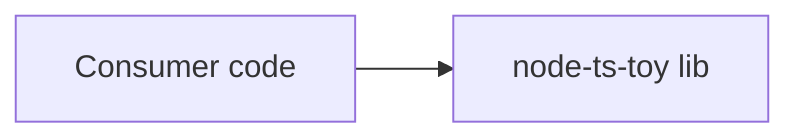

> **Location:** `docs/commits-and-architecture/plans/v1-rollout/phase-2-architect-role/T11-migrate-node-ts-toy.md`

---

id: T11
title: Migrate node-ts-toy to architect-aware config + skeleton arch doc
role: coder
tdd: relaxed
depends_on: [T10]

---

# T11 — Migrate node-ts-toy

**Files (in `C:\Users\nmuno\OneDrive\Documentos\Frutas\arandano-examples\node-ts-toy`):**

- Modify: `.arandano/config.yaml` — add the architect role block
- Create: `docs/architecture.md` — seeded skeleton (mirror what T7 ships for new projects)

**Why:** node-ts-toy is the only live consumer of the CLI right now. To run the Phase 2 e2e (T12), it needs the same surface a freshly-scaffolded project would have after T7.

---

- [ ] **Step 1: Add the architect block to `.arandano/config.yaml`**

Edit `arandano-examples/node-ts-toy/.arandano/config.yaml`:

```diff
 roles:
   coder:
     cli: claude
     model: claude-haiku-4-5-20251001
     tdd: relaxed
+  architect:
+    cli: claude
+    model: claude-haiku-4-5-20251001
+    enabled: true
```

> Use the same CLI + model as the existing coder block so the e2e doesn't introduce a new provider dependency.

- [ ] **Step 2: Create `docs/architecture.md`**

Write `arandano-examples/node-ts-toy/docs/architecture.md` with the seeded skeleton (you can hand-tailor it; the template helper isn't published yet so you copy the content):

````markdown
> **Location:** `docs/architecture.md`

# node-ts-toy — Architecture

_Last updated by: nmunozsi (seeded by hand, pre-architect-run) — 2026-05-15_

## 1. Overview

A trivial Node.js + TypeScript toy used as the canonical e2e target for the arandano CLI. Tests run under Vitest; lint is ESLint + typescript-eslint; format is Prettier.

## 2. Components

| Component     | Path             | Responsibility                         | Stack               |
| ------------- | ---------------- | -------------------------------------- | ------------------- |
| Library entry | `src/index.ts`   | Exports the helper functions tasks add | TypeScript          |
| Tests         | `src/__tests__/` | Vitest test files                      | TypeScript / Vitest |

## 3. Data flow



## 4. Tech stack

- **Language(s):** TypeScript 5
- **Runtime:** Node 22
- **Build:** none (consumed as source)
- **Test:** Vitest
- **CI:** GitHub Actions
- **External services / APIs:** none

## 5. Key decisions

_(initial seed — append as plans land)_

## 6. Open questions

_(none yet)_
````

- [ ] **Step 3: Format the new file**

Run prettier on the node-ts-toy repo to avoid the `npx prettier --check .` gate failure documented in `CLAUDE.md`:

```bash
cd arandano-examples/node-ts-toy
npx prettier --write docs/architecture.md .arandano/config.yaml
```

- [ ] **Step 4: Commit (in node-ts-toy repo)**

```bash
git add docs/architecture.md .arandano/config.yaml
git commit -m ":sparkles: feat(arandano): add architect role config and arch.md skeleton"
git push origin main
```

> The commit must follow the new gitmoji format because `node-ts-toy`'s `.commitlintrc.cjs` was already flipped in Phase 1 T9.

## Acceptance

- `node-ts-toy`'s `.arandano/config.yaml` has `roles.architect.enabled: true`
- `node-ts-toy/docs/architecture.md` exists with the 6-section skeleton
- Both files commit cleanly with a `:sparkles:` prefix
- `git push` to main succeeds
