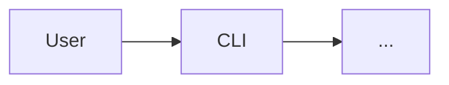

> **Location:** `docs/commits-and-architecture/plans/v1-rollout/phase-2-architect-role/T2-architecture-template.md`

---

id: T2
title: architecture.md.tpl asset
role: coder
tdd: relaxed
depends_on: [T1]

---

# T2 — architecture.md template asset

**Files:**

- Create: `packages/templates/assets/architecture.md.tpl`
- Modify: `packages/templates/src/index.ts` (export `ARCHITECTURE_TEMPLATE_PATH` constant + read helper)
- Modify: `packages/templates/src/__tests__/architecture.test.ts` (new test file)
- Modify: `packages/templates/package.json` `files` array (add `assets`)

**Why:** A single source of truth for the architecture skeleton. The arandano monorepo seeds its own `docs/architecture.md` from this in T8. The stack templates copy it into scaffolded projects in T7. The worker reads it as a reference in T3/T9.

---

- [ ] **Step 1: Create the template file**

Create `packages/templates/assets/architecture.md.tpl` with this exact content (the file ends in `.tpl` because it has `{{name}}`):

````markdown
> **Location:** `docs/architecture.md`

# {{name}} — Architecture

_Last updated by: arandano architect role — `<plan-slug>` plan (YYYY-MM-DD)_

## 1. Overview

One paragraph: what this project does and the shape of the system at a glance.

## 2. Components

| Component  | Path           | Responsibility       | Stack              |
| ---------- | -------------- | -------------------- | ------------------ |
| _e.g._ CLI | `packages/cli` | User-facing commands | TypeScript / oclif |

## 3. Data flow



One diagram. If multiple flows matter, add labelled sub-headings under H3 — never more than three.

## 4. Tech stack

- **Language(s):** …
- **Runtime:** …
- **Build:** …
- **Test:** …
- **CI:** …
- **External services / APIs:** …

## 5. Key decisions

Append-only, dated, newest first. Format:

- **YYYY-MM-DD — D<n>: <short title>.** _Why:_ … _Trade-off:_ … _Owner:_ @handle.

## 6. Open questions

Same format as §5. Entries are removed when resolved (their resolution lands in §5).
````

- [ ] **Step 2: Export a helper that reads the template**

Edit `packages/templates/src/index.ts`. Locate the existing exports (probably re-exports from `scaffold.ts` and `stacks.ts`). Add:

```ts
import { readFile } from 'node:fs/promises';
import { dirname, join } from 'node:path';
import { fileURLToPath } from 'node:url';

const HERE = dirname(fileURLToPath(import.meta.url));
export const ARCHITECTURE_TEMPLATE_PATH = join(HERE, '..', 'assets', 'architecture.md.tpl');

export async function readArchitectureTemplate(name: string): Promise<string> {
  const text = await readFile(ARCHITECTURE_TEMPLATE_PATH, 'utf8');
  return text.replaceAll('{{name}}', name);
}
```

- [ ] **Step 3: Add a unit test**

Create `packages/templates/src/__tests__/architecture.test.ts`:

```ts
import { describe, expect, it } from 'vitest';
import { readArchitectureTemplate } from '../index.js';

describe('readArchitectureTemplate', () => {
  it('substitutes the project name', async () => {
    const out = await readArchitectureTemplate('demo');
    expect(out).toContain('# demo — Architecture');
    expect(out).toContain('## 1. Overview');
    expect(out).toContain('## 6. Open questions');
  });

  it('contains six top-level sections', async () => {
    const out = await readArchitectureTemplate('demo');
    const headings = out.match(/^## \d\. /gm) ?? [];
    expect(headings.length).toBe(6);
  });
});
```

- [ ] **Step 4: Add `assets` to the published files**

Edit `packages/templates/package.json`:

```diff
   "files": [
     "dist",
+    "assets",
     "commitlint-rules",
     "stacks"
   ],
```

- [ ] **Step 5: Run tests**

```bash
npm test --workspace=@arandano/templates
```

Expected: PASS.

- [ ] **Step 6: Commit**

```bash
git add packages/templates/assets/architecture.md.tpl \
        packages/templates/src/index.ts \
        packages/templates/src/__tests__/architecture.test.ts \
        packages/templates/package.json
git commit -m ":sparkles: feat(templates): architecture.md template + readArchitectureTemplate helper"
```

## Acceptance

- `packages/templates/assets/architecture.md.tpl` exists with all 6 sections
- `readArchitectureTemplate('demo')` returns text containing `# demo — Architecture`
- The two new tests pass
