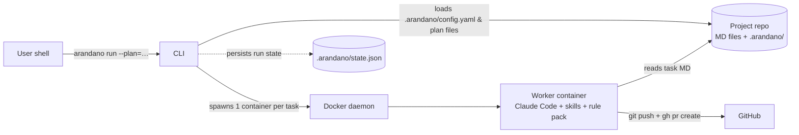

> **Location:** `docs/commits-and-architecture/plans/v1-rollout/phase-2-architect-role/T8-seed-monorepo-architecture.md`

---

id: T8
title: Seed docs/architecture.md in the monorepo
role: coder
tdd: relaxed
depends_on: [T2]

---

# T8 — Replace the monorepo's architecture.md stub with seeded content

**Files:**

- Modify: `docs/architecture.md` (currently a 3-line stub)
- Modify: `CLAUDE.md` (add "Architect role and architecture.md" section)

**Why:** Today `docs/architecture.md` is a stub pointing at the deleted `arandano-design.md`. The architect role expects a file shaped like the template. We seed it once, by hand, from `docs/initial-build/spec.md`, so the first architect run has a familiar shape and produces a small diff. We also document the new role in `CLAUDE.md` so future agent sessions know about it.

---

- [ ] **Step 1: Read the existing stub and the source spec**

```bash
cat docs/architecture.md
cat docs/initial-build/spec.md | head -200
```

- [ ] **Step 2: Replace the file with the seeded template**

Overwrite `docs/architecture.md` with:

````markdown
> **Location:** `docs/architecture.md`

# arandano — Architecture

_Last updated by: nmunozsi (seeded by hand, pre-architect-role) — 2026-05-15_

## 1. Overview

arandano is a CLI tool (`arandano run <task-id>`) that dispatches software-engineering tasks to a Docker-based AI worker. The worker runs a CLI agent (Claude Code, OpenCode, Gemini, Codex…) inside a container against a bind-mounted project workspace, applies TDD, runs a quality gate suite (format, lint, types, tests, coverage, security, commit message), opens a GitHub PR, and reports back. Plans, specs, tasks, memory, and issues all live as Markdown in the repo; orchestrator state is a single `.arandano/state.json`.

## 2. Components

| Component       | Path                                            | Responsibility                                                                                                           | Stack                       |
| --------------- | ----------------------------------------------- | ------------------------------------------------------------------------------------------------------------------------ | --------------------------- |
| CLI             | `packages/cli`                                  | `arandano` oclif binary; subcommands `init`, `run`, `status`, `retry`, `cleanup`, `doctor`, `migrate`, `memory`, `issue` | TypeScript / oclif 4        |
| Core            | `packages/core`                                 | DAG construction, plan loader, state store, types, reviewer + architect synthesis, Orchestrator                          | TypeScript                  |
| Docker executor | `packages/executors-docker`                     | dockerode wrapper that spawns a worker container per task                                                                | TypeScript / dockerode      |
| Templates       | `packages/templates`                            | Stack scaffolds, commitlint rule pack, architecture template, location-header helpers                                    | TypeScript                  |
| Skills          | `packages/skills`                               | Bundled skill metadata + SKILL.md assets (`gitmoji-commits`, `architect`) read by the worker                             | TypeScript + MD             |
| Worker          | `arandano-worker` (separate repo)               | Container image: reads the task MD, runs the CLI agent, enforces gates, opens PR                                         | TypeScript / tsup / Node 22 |
| Example project | `arandano-examples/node-ts-toy` (separate repo) | The canonical test target the CLI runs against                                                                           | TypeScript / Vitest         |

## 3. Data flow



## 4. Tech stack

- **Language(s):** TypeScript (5.x) everywhere except shell glue and a tiny CJS commitlint rule pack.
- **Runtime:** Node 22 (CLI, core, worker, templates).
- **Build:** tsup (worker), tsc (libraries), `npm run -ws build --if-present` at root.
- **Test:** Vitest 1.x; `node --test` for the standalone commitlint rule pack.
- **CI:** GitHub Actions for the monorepo, separate `release.yml` in `arandano-worker` for image build + GHCR push.
- **External services / APIs:** Docker (local or remote daemon), GitHub (`gh` CLI for PR creation), Anthropic API (Claude Code), GHCR (worker image registry).

## 5. Key decisions

- **2026-05-15 — D1: Adopt gitmoji + Conventional Commits.** _Why:_ visual scan in `git log` plus existing tool compatibility. _Trade-off:_ two conventions to teach. _Owner:_ @nmunozsi.
- **2026-05-15 — D2: Introduce architect role.** _Why:_ keep `docs/architecture.md` in lockstep with shipped work. _Trade-off:_ extra PR per plan. _Owner:_ @nmunozsi.

(Historical decisions D1–D19 from the design predate this log and live in `docs/initial-build/spec.md` §3.)

## 6. Open questions

- **2026-05-15 — Q1: Should the architect run after a phase run that opens its own PR series?** Currently only `--with-architect` enables it. Revisit after Phase 2 e2e.
````

- [ ] **Step 3: Validate the file shape**

```bash
grep -c '^## ' docs/architecture.md
```

Expected: `6`.

- [ ] **Step 4: Add an "Architect role and architecture.md" section to CLAUDE.md**

Append a new top-level section to `CLAUDE.md`:

```markdown
## Architect role and architecture.md

`docs/architecture.md` is the single source of truth for this project's architectural state. It has exactly six sections (Overview, Components, Data flow, Tech stack, Key decisions, Open questions); the template lives at `packages/templates/assets/architecture.md.tpl`.

The `architect` role refreshes the file at the end of every full-plan `arandano run --plan=<slug>`. The orchestrator auto-spawns a synthetic `T-architect` task that depends on every other task in the plan; the worker reads `/opt/arandano/skills/architect/SKILL.md` and applies minimal-diff edits per its rules. Per-plan PR title: `:memo: docs(arch): refresh after <plan-slug>`.

CLI flags on `arandano run`:

- `--with-architect` — force the architect task even when disabled in config or running a phase.
- `--no-architect` — suppress the architect task even when enabled in config.
- The two flags are mutually exclusive; passing both errors before dispatch.
- Single-task runs (`arandano run T<id>`) ignore both flags and never spawn architect.
- Phase runs (`--plan=<slug> --phase=<slug>`) ignore the config default; the architect runs only if `--with-architect` is set explicitly.

If the architect's edit produces no diff against `docs/architecture.md`, the worker logs `architect: no-op` and exits 0 without opening a PR. The orchestrator records `T-architect.result = "no-op"` in `state.json`.
```

- [ ] **Step 5: Commit**

```bash
git add docs/architecture.md CLAUDE.md
git commit -m ":memo: docs(arch): seed docs/architecture.md and document architect role"
```

## Acceptance

- `docs/architecture.md` is no longer a 3-line stub
- Exactly 6 `## ` headings exist in the file
- `CLAUDE.md` has a new "Architect role and architecture.md" section
- The commit subject uses `:memo:` prefix
