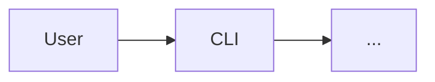

> **Location:** `docs/commits-and-architecture/spec.md`
>
> **Folder structure:**
>
> ```
> docs/commits-and-architecture/
> ├── spec.md          ← you are here
> └── plans/
>     └── <plan-slug>/  (implementation plan, written next)
> ```

---

title: Commit conventions and live architecture doc
status: approved, ready for implementation planning
author: nmunozsi (with Claude)
date: 2026-05-15

---

# Commit conventions and live architecture doc

Adopt gitmoji on top of Conventional Commits across the arandano monorepo, the worker, and every project scaffolded by `arandano init`. Introduce a single `docs/architecture.md` template that lives in both the monorepo and every client project, kept in lockstep with shipped work by a new `architect` worker role that runs once at the end of every plan execution.

## 1. Goal

Two coupled deliverables:

1. **Commit message structure.** A strict, machine-enforced format combining gitmoji (shortcode form) with Conventional Commits — `:emoji: type(scope): subject` — backed by a curated 16-emoji mapping that is 1:1 with the Conventional types we already use. The format applies identically to the arandano monorepo and every project scaffolded via `arandano init`. The worker learns the convention via a bundled skill before the rule is flipped on, so worker-generated commits never fail the lint.

2. **Live architecture document.** A single `architecture.md` template, located at `docs/architecture.md` in both the monorepo and every scaffolded client project. The doc is refreshed at the end of every `arandano run --plan=<slug>` by a new `architect` role — a third built-in role alongside `coder` and `reviewer` — which reads the merged plan diff and applies minimal edits across six fixed sections. The result is one PR per plan, titled `:memo: docs(arch): refresh after <plan-slug>`.

## 2. Non-goals

- Rewriting historical commits to the new format. Existing history stays as-is; the rule applies to new commits only.
- A standalone `arandano lint commits` CLI. Commitlint via `commit-msg` hook and CI is enough.
- Generating architecture content from AST/source analysis. The architect role works from the plan's spec/plan/diff, not from a code scanner.
- Multi-diagram architecture docs. The template caps at one diagram in §3 (or three labelled sub-diagrams in extreme cases).
- A web UI for browsing architecture history. The MD file and `git log` are enough.
- Backwards compatibility with the current `.commitlintrc.cjs` rule. Drop it; flip in one PR after the worker is taught.

## 3. Key decisions

| #   | Decision                                                                                                                                                                             | Rationale                                                                                                 |
| --- | ------------------------------------------------------------------------------------------------------------------------------------------------------------------------------------ | --------------------------------------------------------------------------------------------------------- |
| D1  | Gitmoji is layered ON TOP of Conventional Commits, not replacing it. Format: `:emoji: type(scope): subject`.                                                                         | Preserves changelog tooling, semantic-release compatibility, and the existing 100+ commits' parse shape.  |
| D2  | Shortcode form (`:sparkles:`), not unicode (`✨`).                                                                                                                                   | Portable across terminals/log parsers; what `gitmoji-cli` defaults to; renders fine on GitHub.            |
| D3  | Strict enforcement via a custom commitlint rule pack. Both the monorepo root and every stack template ship the same pack.                                                            | Matches arandano's "quality gates by default" stance (D17 in `initial-build/spec.md`).                    |
| D4  | Curated 16-emoji subset, 1:1 with the Conventional types we use (see §4). Anything outside the set is rejected.                                                                      | Crisp, teachable, and lintable. No "feels right" ambiguity.                                               |
| D5  | A `gitmoji-commits` skill is bundled into the worker image and BEFORE the lint rule flips. Phase 1 ships the skill, then the rule.                                                   | Avoids the rollout footgun where the worker writes a non-conforming commit and fails its own run.         |
| D6  | One architecture.md template, used identically for monorepo and clients. Six fixed sections: Overview, Components, Data flow, Tech stack, Key decisions (dated log), Open questions. | Same shape everywhere → architect role can be mechanical, no per-project special cases.                   |
| D7  | The `architect` role is the third built-in role alongside `coder` and `reviewer`. It has a per-role config block in `.arandano/config.yaml` (cli, model, enabled).                   | Symmetrical with the existing role model; reuses dispatch + container + PR machinery.                     |
| D8  | The architect task is auto-spawned at the end of full-plan runs (`arandano run --plan=<slug>` without `--phase=`, not for single-task runs).                                         | Architect needs the whole plan's delta to do meaningful work. Phase runs and single-task runs stay light. |
| D9  | CLI flags `--with-architect` and `--no-architect` override the config default. Mutually exclusive. Passing both is an error.                                                         | Configurable per role, with a manual override flag — explicit user request.                               |
| D10 | When the architect's diff against `architecture.md` is empty, the worker does NOT open a PR. State is marked `no-op` in `state.json`.                                                | Avoid PR noise on plans with no architectural impact.                                                     |

## 4. Gitmoji convention — curated mapping

The commitlint rule accepts ONLY these 16 emoji shortcodes, each paired with one Conventional Commits type:

| Emoji shortcode         | Type       | Use for                          |
| ----------------------- | ---------- | -------------------------------- |
| `:sparkles:`            | `feat`     | New feature for the user         |
| `:bug:`                 | `fix`      | User-visible bug fix             |
| `:ambulance:`           | `fix`      | Critical hotfix                  |
| `:lock:`                | `fix`      | Security-impacting fix           |
| `:zap:`                 | `perf`     | Performance improvement          |
| `:recycle:`             | `refactor` | Refactor with no behavior change |
| `:fire:`                | `refactor` | Remove code/files                |
| `:white_check_mark:`    | `test`     | Add or update tests              |
| `:memo:`                | `docs`     | Docs only                        |
| `:art:`                 | `style`    | Formatting, whitespace, no logic |
| `:rotating_light:`      | `style`    | Fix linter warnings              |
| `:wrench:`              | `chore`    | Config / tooling                 |
| `:construction_worker:` | `ci`       | CI changes                       |
| `:arrow_up:`            | `chore`    | Upgrade dependencies             |
| `:arrow_down:`          | `chore`    | Downgrade dependencies           |
| `:bookmark:`            | `chore`    | Release / version tag            |

**Worked examples:**

```
:sparkles: feat(cli): add --with-architect flag
:bug: fix(executors-docker): inject git safe.directory env vars
:white_check_mark: test(core): cover DAG cycle detection
:memo: docs(plans): mark Task 3 complete
:wrench: chore(deps): bump dockerode to 4.0.4
:fire: refactor(templates): remove legacy tasks/ scaffold
```

**Merge commits** are exempted via commitlint's `ignores` array (`/^Merge /`).

## 5. Architecture.md template

````markdown
> **Location:** `docs/architecture.md`

# {{name}} — Architecture

_Last updated by: arandano architect role — `{{plan_slug}}` plan ({{date}})_

## 1. Overview

One paragraph: what this project does and the shape of the system at a glance.

## 2. Components

| Component  | Path           | Responsibility       | Stack              |
| ---------- | -------------- | -------------------- | ------------------ |
| _e.g._ CLI | `packages/cli` | User-facing commands | TypeScript / oclif |

## 3. Data flow



One diagram. If multiple flows matter, add labelled sub-headings under H3 — never more than three.

## 4. Tech stack

- **Language(s):** …
- **Runtime:** …
- **Build:** …
- **Test:** …
- **CI:** …
- **External services / APIs:** …

## 5. Key decisions

Append-only, dated, newest first. Format:

- **YYYY-MM-DD — D<n>: <short title>.** _Why:_ … _Trade-off:_ … _Owner:_ @handle.

## 6. Open questions

Same format as §5. Entries are removed when resolved (their resolution lands in §5).
````

### Why these sections

- §1 and §2 are the only sections a new contributor or agent must read first.
- §3 is intentionally capped at one diagram — the worker won't try to keep five diagrams in sync.
- §5 is append-only and dated → architect's job is mechanical: read the merged plan, append one entry, possibly add/edit one row in §2.
- §6 captures debt without needing its own file.

### Seeding

- **Monorepo:** the seeding of `docs/architecture.md` is done by a coder task in Phase 2 (NOT by the architect role) — it derives the initial content from `docs/initial-build/spec.md` so we don't ship an empty doc. The current 3-line stub at `docs/architecture.md` is replaced. The architect role takes over from there on the first plan run that includes it.
- **Client projects:** `arandano init` drops in the skeleton with `{{name}}` substituted. §2–§6 are left as placeholders. The first plan execution's architect task fills them in.

## 6. Architect role

### Config

`packages/templates/stacks/*/.arandano/config.yaml.tpl` and `.arandano/config.yaml` (in `node-ts-toy`) gain a third role block:

```yaml
roles:
  coder: { cli: claude-code, model: sonnet-4.6, tdd: strict }
  reviewer: { cli: claude-code, model: sonnet-4.6 }
  architect: { cli: claude-code, model: sonnet-4.6, enabled: true }
```

The default of `enabled: true` matches the spec's stance that architecture stays in lockstep by default.

### Auto-spawn logic

In `packages/core/src/orchestrator/` (or the plan loader, whichever owns DAG construction):

1. If the run is a full-plan run (`--plan=<slug>`, no `--phase=`, no single task id) AND (`config.roles.architect.enabled === true` OR `--with-architect` was passed) AND `--no-architect` was NOT passed, then append a synthetic task `T-architect`.
2. `T-architect.depends_on` = every other task in the resolved plan (after reviewer expansion).
3. `T-architect` body is generated from `packages/skills/architect/template.md.tpl` with these substitutions: plan slug, plan path, merge-commit range, today's date.
4. The orchestrator passes `ARANDANO_PLAN_MERGE_RANGE=<base>..<head>` to the container so the architect's worker can `git log` exactly the commits that landed.

### CLI flags

`packages/cli/src/commands/run.ts`:

- `--with-architect` — append the architect task even when config says `enabled: false`.
- `--no-architect` — suppress the architect task even when config says `enabled: true`.
- Mutually exclusive; passing both is a hard error before dispatch.
- Single-task runs ignore the flags.
- `--phase=<slug>` runs ignore the flags too, unless `--with-architect` is set explicitly — then architect runs against the phase's delta.

### Architect skill

`packages/skills/architect/SKILL.md` contains:

- The six-section template (mirror of §5 above).
- Section-by-section "do" / "don't" rules. Examples:
  - "Do append to §5 with today's date." / "Do not rewrite or reorder existing §5 entries."
  - "Do edit §2 rows when a component's responsibility changed." / "Do not delete a §2 row without first adding a §5 entry explaining the removal."
  - "Do regenerate the §3 diagram only when §2 changed." / "Do not touch §3 if §2 didn't change."
- Two worked examples: (a) a plan that added a new package → §2 row added + §5 entry + §3 updated; (b) a plan that only refactored internals → §5 entry only.

### Worker image impact

The new skill ships in `arandano-worker/lib/src/skills/architect/` alongside existing skills. A worker rebuild + GHCR push (via `release.yml`) is required before Phase 2 lands in the CLI.

### Empty-diff behavior

If the architect's edit produces no diff against `architecture.md`, the worker logs `architect: no-op` and exits 0 without opening a PR. The orchestrator records the no-op in `state.json` under `runs/<plan>/T-architect.result = no-op`.

## 7. Surface changes (file-by-file)

### Monorepo (`arandano`)

| File                                                                           | Change                                                                                  |
| ------------------------------------------------------------------------------ | --------------------------------------------------------------------------------------- |
| `.commitlintrc.cjs`                                                            | Switch from `@commitlint/config-conventional` to the new pack                           |
| `packages/templates/commitlint-rules/index.cjs` (new)                          | The new rule pack: extends conventional + adds `gitmoji-leading` + `gitmoji-type-match` |
| `packages/skills/gitmoji-commits/SKILL.md` (new)                               | Skill content for the worker                                                            |
| `packages/skills/architect/SKILL.md` (new)                                     | Skill content for the architect role                                                    |
| `packages/skills/architect/template.md.tpl` (new)                              | Task body template for the synthetic architect task                                     |
| `packages/templates/architecture.md.tpl` (new)                                 | Single source of truth for the arch doc skeleton                                        |
| `docs/architecture.md`                                                         | Replace 3-line stub with seeded content                                                 |
| `packages/templates/stacks/{node-ts,python,go}/.commitlintrc.cjs.tpl`          | Switch to the new pack                                                                  |
| `packages/templates/stacks/{node-ts,python,go}/docs/architecture.md.tpl` (new) | Skeleton scaffolded by `arandano init`                                                  |
| `packages/templates/stacks/{node-ts,python,go}/.arandano/config.yaml.tpl`      | Add `architect:` role block                                                             |
| `packages/core/src/types/config.ts`                                            | Add `ArchitectRoleConfig` type and field                                                |
| `packages/core/src/orchestrator/` (existing file)                              | Auto-spawn `T-architect` per §6                                                         |
| `packages/cli/src/commands/run.ts`                                             | Add `--with-architect` and `--no-architect` flags with mutual-exclusivity check         |
| `CLAUDE.md`                                                                    | New section: commit conventions; new section: architect role + architecture.md          |
| `CONTRIBUTING.md`                                                              | Document the gitmoji format with the curated table                                      |

### Worker (`arandano-worker`)

| File                                            | Change                                   |
| ----------------------------------------------- | ---------------------------------------- |
| `lib/src/skills/gitmoji-commits/SKILL.md` (new) | Copy of monorepo skill                   |
| `lib/src/skills/architect/SKILL.md` (new)       | Copy of monorepo skill                   |
| Dockerfile                                      | Skill copy step (if not already globbed) |

### Client project (`node-ts-toy`, migrated in-PR)

| File                         | Change                      |
| ---------------------------- | --------------------------- |
| `.commitlintrc.cjs`          | Switch to the new pack      |
| `.arandano/config.yaml`      | Add `architect:` role block |
| `docs/architecture.md` (new) | Scaffolded skeleton         |

## 8. Migration & rollout order

One spec, one plan, two phases. Critical ordering rule: teach the worker BEFORE flipping the lint rule, or the worker's own commits fail the new rule mid-run.

### Phase 1 — Commit conventions

1. Author `packages/skills/gitmoji-commits/SKILL.md`.
2. Write the custom commitlint rule pack: `packages/templates/commitlint-rules/index.cjs`.
3. Vendor the rule pack into `arandano-worker/lib/src/skills/`.
4. Rebuild the worker image (push to `arandano-worker` main → `release.yml` does the GHCR push).
5. Switch the monorepo root `.commitlintrc.cjs` to the new pack. Run `npm test`; confirm internal tests still pass.
6. Switch each `packages/templates/stacks/*/.commitlintrc.cjs.tpl` to the new pack.
7. Update `CONTRIBUTING.md` + `CLAUDE.md` with the curated table.
8. e2e: a small single-task run against `node-ts-toy` proving the worker produces a gitmoji commit that passes the new rule.

### Phase 2 — Live architecture doc + architect role

1. Author `packages/skills/architect/SKILL.md` (template + do/don't rules + two worked examples).
2. Add `packages/templates/architecture.md.tpl` (single source of truth).
3. Seed `docs/architecture.md` in the monorepo with real content derived from `docs/initial-build/spec.md`.
4. Drop `docs/architecture.md.tpl` into each stack template's `docs/`.
5. Extend the config schema in `packages/core/src/types/config.ts` with the `architect:` block (default `enabled: true`).
6. Implement auto-spawn of the synthetic `T-architect` task in the orchestrator/plan loader per §6.
7. Wire `--with-architect` / `--no-architect` into `packages/cli/src/commands/run.ts` with mutual-exclusivity check.
8. Bundle the architect skill into the worker image; rebuild and push.
9. Migrate `node-ts-toy`: scaffold its `docs/architecture.md`, add `architect:` to its `.arandano/config.yaml`.
10. e2e: a two-task plan against `node-ts-toy` proving the architect task fires, edits `docs/architecture.md`, and opens a PR titled `:memo: docs(arch): refresh after <plan-slug>`.

## 9. Acceptance criteria

- [ ] `.commitlintrc.cjs` at monorepo root references the new rule pack; commits that violate the rule are rejected
- [ ] `packages/templates/commitlint-rules/index.cjs` exports a config that extends `@commitlint/config-conventional` and adds `gitmoji-leading` + `gitmoji-type-match` rules; both rules unit-tested
- [ ] Every stack template's `.commitlintrc.cjs.tpl` uses the new pack
- [ ] `packages/skills/gitmoji-commits/SKILL.md` exists with the curated mapping table and at least 3 worked examples
- [ ] `packages/skills/architect/SKILL.md` exists with template, do/don't rules, and 2 worked examples
- [ ] `packages/templates/architecture.md.tpl` exists with all 6 sections of §5
- [ ] `docs/architecture.md` is no longer a 3-line stub; contains real seeded content matching the template
- [ ] Every stack template ships `docs/architecture.md.tpl`
- [ ] `arandano init <stack>` writes `docs/architecture.md` to the scaffolded project
- [ ] `.arandano/config.yaml.tpl` for each stack includes an `architect:` block
- [ ] `packages/core/src/types/config.ts` exposes `ArchitectRoleConfig`; `config.roles.architect.enabled` defaults to `true`
- [ ] Orchestrator appends a synthetic `T-architect` task to full-plan runs when `enabled === true` or `--with-architect` is passed, and skips it when `--no-architect` is passed
- [ ] `arandano run --with-architect --no-architect` errors before dispatch
- [ ] `arandano run T<id>` (single task) ignores the flags and never spawns architect
- [ ] `arandano run --plan=<slug> --phase=<slug>` ignores `enabled`; only spawns architect if `--with-architect` is set
- [ ] Worker image rebuilt and published with both new skills (`gitmoji-commits`, `architect`) BEFORE the new commitlint rule is flipped on
- [ ] `node-ts-toy` migrated: `.commitlintrc.cjs`, `.arandano/config.yaml`, `docs/architecture.md` all updated in the same PR
- [ ] CLAUDE.md gains: a "Commit conventions" section with the curated table; an "Architect role and architecture.md" section
- [ ] CONTRIBUTING.md gains the curated table and one worked example per type
- [ ] e2e Phase 1: a single-task run against `node-ts-toy` produces a passing gitmoji commit
- [ ] e2e Phase 2: a two-task plan run against `node-ts-toy` produces an architect PR titled `:memo: docs(arch): refresh after <plan-slug>` with non-empty diff against `docs/architecture.md`
- [ ] An architect run with no architectural change produces `architect: no-op` in `state.json` and opens no PR
- [ ] All existing tests still pass

## 10. Out of scope (explicitly deferred)

- Rewriting historical commits in the arandano monorepo or in `node-ts-toy`. The rule applies to new commits only.
- A standalone `arandano lint commits` command. Use commitlint via hook + CI.
- Auto-generating §3 diagrams from source analysis. Architect role edits the diagram by hand from the plan's intent.
- Per-stack architecture template variation. The same six-section template applies to every stack.
- A timeout / auto-close for empty-diff architect PRs (architect skips the PR entirely instead).
- Multi-architect-task plans (e.g., per-phase architects). Architect runs at end of plan only.
- A `arandano architecture refresh` standalone CLI for manual runs. Use `--with-architect` on a no-op plan instead.

## 11. Risks & mitigations

- **Worker writes commits that fail the new rule mid-run.** Phase 1 ships the skill into the worker BEFORE the rule flips. Step 4 of Phase 1 rebuilds + publishes the worker; step 5 flips the rule only after. The Phase 1 e2e (step 8) is the final gate.
- **Architect races a coder task and they conflict on `architecture.md`.** Architect's `depends_on` is set to every other task in the plan, so by construction it runs last on a clean base after reviewer-task expansion.
- **Empty-diff architect produces unnecessary PRs.** Worker skips PR creation when the diff is empty; `state.json` records `no-op`.
- **External tooling expects pure Conventional Commits.** The Conventional Commits structure is preserved (`type(scope): subject` is intact); only a leading emoji shortcode is added. Tools that parse `feat`/`fix` keep working.
- **Curated mapping is too restrictive for a legitimate commit.** The rule pack's curated table is short and lives in one file; extending it is a one-line change that the user can make via PR. Phase 1's e2e exercises every category we expect the worker to produce.
- **Existing seeded `docs/architecture.md` content drifts from what the architect would produce.** Phase 2 step 3 seeds the doc using the same six-section template the architect uses, so the first architect run sees a familiar shape and produces a minimal diff.
- **`node-ts-toy` migration races in-flight work.** The migration lands in the same PR as the rule flip; no out-of-band coordination needed.
- **Worker image rebuild lag.** The `release.yml` workflow takes a few minutes; Phase 1 step 5 explicitly waits for it before flipping the lint rule.
